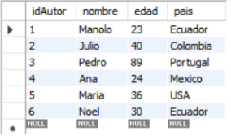
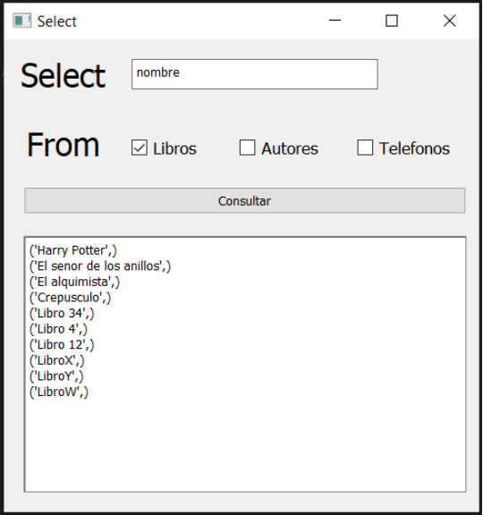

# Multi-Layered Database Application

## Description
This project involves the implementation of a multi-layered application that connects to a MySQL database, designed to manage book records. The application features a graphical user interface (GUI) developed using QtDesigner and Python, enabling users to perform CRUD (Create, Read, Update, Delete) operations on the database. The project demonstrates the integration of multiple windows for different operations, such as selecting, inserting, updating, and deleting records. The application is highly expandable, with the potential to manage more complex data structures and interactions.

**Short Description:** Database Management App

## Database Design and Data

**Database UML Diagram**  
This diagram illustrates the structure of the database, including the relationships between tables.

**Author Table with Data**  
This table contains the details of the authors.

**Books Table with Data**  
This table stores information about the books.

**Books_has_Authors Table with Data**  
This table links books with their respective authors.

**Phone Table with Data**  
This table stores the phone numbers related to the authors or publishers.

## Application Interface

**Main Window**  
The main window of the application features four buttons for different operations: Search Books, Insert Books, Update Books, Delete Books.

**Select/Search Books by Title**  
This window allows users to search for books by their title.

**Select/Search Books by Author**  
This window allows users to search for books by their author.

**Insert Book Window**  
This window requires the user to input the book's ID, name, price, and the number of pages.

**Book Insertion Confirmation**  
This screen shows that the book has been successfully inserted.

**Update Book Window**  
This window allows the user to update the book's details by providing the ID, name, price, and page count. If the ID matches an existing book, the information is overwritten.

**Book Update Confirmation**  
This screen shows that the book's details have been successfully updated.

**Delete Book Window**  
This window requires the user to input the book's ID to delete it from the database.

**Book Deletion Confirmation**  
This screen shows that the book has been successfully deleted.

## Note
The graphical interface was not the primary focus of this project, so a simple one was used. However, the project can be significantly improved and expanded, both in terms of the interface and functionality.
